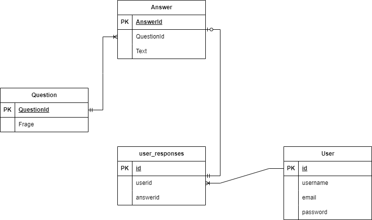
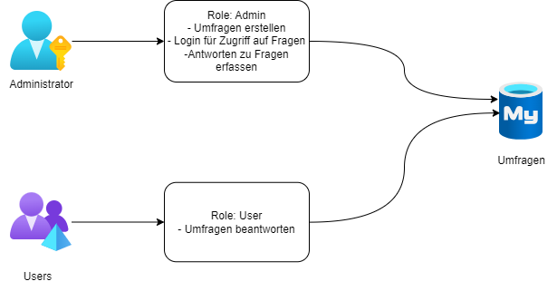

# Umfrage App

## Beschreibung
Die Umfrage App ist eine Webanwendung, die es ermöglicht, Umfragen zu erstellen und diese von anderen Nutzern ausfüllen zu lassen. Die Umfragen können nur von registrerten Benutzern ausgefüllt werden. 

Das Projekt wurde im Rahmen des Modul 223 (Multi-User Applikation) erstellt.

## Inhaltsverzeichnis
- [Umfrage App](#umfrage-app)
  - [Beschreibung](#beschreibung)
  - [Inhaltsverzeichnis](#inhaltsverzeichnis)
  - [Installationen](#installationen)
    - [MySQL](#mysql)
    - [Frontend (React)](#frontend-react)
    - [Backend (Spring Boot)](#backend-spring-boot)
  - [Verwendete Technologien](#verwendete-technologien)
  - [Akzeptanzkriterien](#akzeptanzkriterien)
  - [Dokumentation](#dokumentation)
    - [Datenbank](#datenbank)
    - [RBAC](#rbac)
    - [REST API](#rest-api)
    - [Frontend](#frontend-1)
    - [Backend](#backend-1)
  - [Tests](#tests)
    - [Frontend](#frontend-2)
    - [Backend](#backend-2)
  - [Sicherheit](#sicherheit)
    - [Spring Security](#spring-security)
    - [JWT](#jwt)
    - [BCrypt](#bcrypt)
    - [CORS](#cors)
  - [Hilfestellungen](#hilfestellungen)
    - [MySQL](#mysql-1)
    - [Frontend (React)](#frontend-react-1)
    - [Backend (Spring Boot)](#backend-spring-boot-1)
  - [Fazit](#fazit)


## Installationen

### MySQL
1. Installieren Sie [MySQL](https://dev.mysql.com/downloads/installer/)
2. Starten Sie MySQL
3. Êrstellen Sie einen neuen Benutzer
```sql
CREATE USER 'nutzername'@'localhost' IDENTIFIED BY 'passwort';
```
4. Erstellen Sie eine neue Datenbank
```sql
CREATE DATABASE umfrageapp;
```
5. Geben Sie dem Benutzer alle Rechte auf die Datenbank
```sql
GRANT ALL PRIVILEGES ON umfrageapp.* TO 'nutzername'@'localhost';
```


### Frontend (React)
1. Installieren Sie [Node.js](https://nodejs.org/en/download/)
2. Installieren Sie [NPM](https://www.npmjs.com/get-npm)
3. Klonen Sie das Repository
```bash	
git clone https://github.com/CKnuchel/M223
```
4. Navigieren Sie in den Ordner "M223/frontend"
```bash
cd M223/frontend
```
5. Installieren Sie die benötigten Pakete
```bash
npm install
```
6. Starten Sie das Frontend
```bash
npm start
```
7. Öffnen Sie [http://localhost:5173](http://localhost:5173) um die App im Browser zu sehen.

### Backend (Spring Boot)
1. Installieren Sie [Java](https://www.java.com/de/download/)
2. Klonen Sie das Repository
```bash
git clone https://github.com/CKnuchel/M223
```
3. Navigieren Sie in den Ordner "M223/backend"
```bash
cd M223/backend
```
5. Fügen Sie Ihre MySQL Daten in die Datei "application.properties" ein
```properties
spring.datasource.url=jdbc:mysql://localhost:3306/umfrageapp?serverTimezone=UTC
spring.datasource.username=benutzername
spring.datasource.password=passwort
```

6. Starten Sie das Backend
```bash
./mvnw spring-boot:run
```
7. Öffnen Sie [http://localhost:8080](http://localhost:8080) um die App im Browser zu sehen.

## Verwendete Technologien
- [React](https://reactjs.org/)
- [Spring Boot](https://spring.io/projects/spring-boot)
- [MySQL](https://www.mysql.com/)
- [Bootstrap](https://getbootstrap.com/)
- [JWT](https://jwt.io/)
- [Maven](https://maven.apache.org/)
- [NPM](https://www.npmjs.com/)
- [Git](https://git-scm.com/)
- [Visual Studio Code](https://code.visualstudio.com/)
- [IntelliJ IDEA](https://www.jetbrains.com/idea/)
- [MySQL Workbench](https://www.mysql.com/products/workbench/)
- [Postman](https://www.postman.com/)

## Akzeptanzkriterien

### Umfrage erstellen
| Wer?          | Was?                   | Warum?                                 |
|---------------|------------------------|----------------------------------------|
| Administrator | Kann Umfrage erstellen | Um Meinungen zu einem Thema einzuholen |
Akzeptanzkriterien:
- [ ] Administrator hat Eingabefelder für:
    - [ ] Titel
    - [ ] Beschreibung
    - [ ] Deadline
    - [ ] Liste von Fragen

### Umfrage beanworten
| Wer? | Was?                     | Warum?                                    |
|------|--------------------------|-------------------------------------------|
| User | Kann Umfrage beantworten | Um seine Meinung zu einem Thema abzugeben |
Akzeptanzkriterien:
- [ ] User kann Umfrage beantworten
- [ ] User kann Umfrage nicht mehr beantworten wenn Deadline erreicht
- [ ] User kann Umfrage nicht mehr beantworten, wenn er sie schon beantwortet hat

### Login User
| Wer? | Was?                | Warum?                             |
|------|---------------------|------------------------------------|
| User | Kann sich einloggen | Damit er Umfragen beantworten kann |
Akzeptanzkriterien:
- [ ] User kann sich einloggen
- [ ] User kann sich nicht einloggen, wenn er nicht registriert ist
- [ ] User kann sich nicht einloggen, wenn er falsche Daten eingibt
- [ ] User sieht nach dem Login die aktuell offenen Umfragen

### Login Admin
| Wer?          | Was?                | Warum?                           |
|---------------|---------------------|----------------------------------|
| Administrator | Kann sich einloggen | Damit er Umfragen erstellen kann |
Akzeptanzkriterien:
- [ ] Administrator kann sich einloggen
- [ ] Administrator kann sich nicht einloggen, wenn er nicht registriert ist
- [ ] Administrator kann sich nicht einloggen, wenn er falsche Daten eingibt
- [ ] Administrator sieht nach dem Login die aktuell offenen Umfragen


## Dokumentation

### Datenbank
Die Datenbank besteht aus 4 Tabellen. Die Tabelle "user" enthält alle Benutzer. Die Tabelle "Question" enthält alle Fragen. Die Tabelle "Answer" enthält alle Antworten, in Relation zu den Fragen. Die Tabelle "user_responses" enthält alle Antworten, in Relation zu den Benutzern.



### RBAC


### REST API
| Methode | URL | Beschreibung | Authentifizierung | Parameter |
| --- | --- | --- | --- | --- |
| POST | /api/auth/signup | Registriert einen neuen Benutzer | Nein | username, email, password |
| POST | /api/auth/signin | Loggt einen Benutzer ein | Nein | username, password |
| GET | /api/questions | Gibt alle Fragen zurück | Ja | |
| POST | /questions | Erstellt eine neue Frage | Ja | question : String |
| DELETE | /questions/{id} | Löscht eine Frage | Ja | |
| POST| /answers | Erstellt eine neue Antwort | Ja | answer : String, questionId : Long |
| GET | /answers/{questionId} | Gibt alle Antworten zu einer Frage zurück | Ja | |
|POST | /responses | Erstellt eine neue Antwort eines Benutzers | Ja | answerId : Long, userId : Long|
| GET | /responses | Gibt alle Antworten zurück| Ja | |
| POST | /responses/done | Gibt an ob ein Benutzer eine Umfrage ausgefüllt hat | Ja | userId : Long, questionId : Long |

### Frontend

Die verschiedenen Seiten der Webanwendung sind in der folgenden Tabelle aufgelistet.

| URL | Beschreibung | Authentifizierung |
| --- | --- | --- |
| /login | Login Seite | Nein |
| /questions | Liste aller Fragen | Ja |
| /answers | Liste aller Antworten zu einer Frage | Ja |
| /responses | Beantworten von Fragen | Ja |

Die Seiten sind sehr simpelt gestaltet und erlauben es mit einem Dropdown Feld die verschiedenen Fragen auszuwählen. Die Antworten werden dann in einem Textfeld angezeigt. Die Antworten können dann mit einem Button gespeichert werden.

### Backend

Das Backend ist in 11 Schichten aufgeteilt. Die Schichten sind in der folgenden Tabelle aufgelistet.

| Schicht | Beschreibung |
| --- | --- |
| Config | Konfigurationen für Spring Security |
| Controller | REST Controller |
| DTO | Data Transfer Objects |
| Filter | Filter für Spring Security |
| Model | Datenbank Modelle |
| Repository | Spring Data Repositories |
| Request | REST Requests |
| Security | Spring Security |
| Service | Services |
| Tests | Tests |
| Util | Verschiedene Utilities |

## Tests

### Frontend
Die Tests sind im Ordner "M223/frontend/src/tests" zu finden. Die Tests sind mit dem Framework [Jest](https://jestjs.io/) geschrieben. Die Tests können wie folgt ausgeführt werden.
```bash
cd M223/frontend
npm test
```

#### Vorhandene Tests
- auth.service.test.js
- get_questions.test.js 

##### auth.service.test.js
Dieser Test überprüft, ob der Login funktioniert. Dazu wird ein Benutzer erstellt und dann versucht, sich mit diesem Benutzer einzuloggen. Wenn der Login funktioniert, wird überprüft, ob der Benutzer eingeloggt ist. Danach wird der Benutzer wieder gelöscht.

##### get_questions.test.js
Dieser Test überprüft, ob die Fragen abgerufen werden können. Dazu wird ein Benutzer erstellt und dann versucht, sich mit diesem Benutzer einzuloggen. Wenn der Login funktioniert, wird überprüft, ob die Fragen abgerufen werden können. Danach wird der Benutzer wieder gelöscht.


### Backend
Die Tests sind im Ordner "M223\src\main\java\com\wiss\m223\Tests zu finden.
Die Tests sind mit dem Framework [JUnit](https://junit.org/junit5/) und [Mockito](https://site.mockito.org/) geschrieben. Die Tests können wie folgt ausgeführt werden.
```bash
cd M223/backend
./mvnw test
```

#### Vorhandene Tests
Für Die folgenden Schichten, wurden Tests geschrieben:
- Config
- Controller
- DTO
- Filter
- Model

Die Tests decken die wichtigsten Funktionen der Schichten ab.
Genaurere Informationen zu den Tests sind in den Klassen Kommentaren zu finden.

## Sicherheit
Sie Sicherheit der Webanwendung wird mit folgenden Technologien gewährleistet.

### Spring Security
Spring Security ist ein Framework, welches es ermöglicht, die Sicherheit einer Webanwendung zu gewährleisten. Spring Security bietet verschiedene Möglichkeiten, um die Sicherheit zu gewährleisten. In diesem Projekt wird Spring Security verwendet, um die Authentifizierung und die Autorisierung zu gewährleisten.

### JWT
JWT (JSON Web Token) ist ein offener Standard, der es ermöglicht, Daten zwischen zwei Parteien zu übertragen. In diesem Projekt wird JWT verwendet, um die Authentifizierung zu gewährleisten. Wenn sich ein Benutzer einloggt, wird ein JWT erstellt und dem Benutzer zurückgegeben. Dieser JWT wird dann bei jeder Anfrage mitgeschickt. Der JWT enthält die Benutzer ID und den Benutzernamen. Der JWT wird mit einem Secret verschlüsselt, damit der Benutzer den JWT nicht manipulieren kann.

### BCrypt
BCrypt ist ein Hashing Algorithmus, der es ermöglicht, Passwörter zu verschlüsseln. In diesem Projekt wird BCrypt verwendet, um die Passwörter der Benutzer zu verschlüsseln.

### CORS
CORS (Cross-Origin Resource Sharing) ist ein Mechanismus, der es ermöglicht, dass eine Webanwendung auf Ressourcen zugreifen kann, die auf einem anderen Server liegen. In diesem Projekt wird CORS verwendet, um die Kommunikation zwischen dem Frontend und dem Backend zu ermöglichen.


## Hilfestellungen

### MySQL
Da die Datenbank durch Spring Boot generiert wurde, kamm zu rEntwicklung nur [MySQL Workbench](https://www.mysql.com/products/workbench/) zum Einsatz.

### Frontend (React)
Durch fehlende Erfahrungen wurde hier auf die [React Dokumentation](https://reactjs.org/docs/getting-started.html) zurückgegriffen.

Sowie auf die Hilfe von [ChatGPT](https://chat.openai.com/) und [GitHUb Copilot](https://copilot.github.com/)

Hilfe wurde von folgenden Mitschülern erhalten:
- Jason Termine

### Backend (Spring Boot)
Durch fehlende Erfahrungen wurde hier auf die [Spring Boot Dokumentation](https://spring.io/projects/spring-boot) zurückgegriffen.

Sowie auf die Hilfe von [ChatGPT](https://chat.openai.com/) und [GitHUb Copilot](https://copilot.github.com/)

Hilfe wurde von folgenden Mitschülern erhalten:
- Jason Termine

Hilfe wurde von folgenden Lehrern erhalten:
- Sven Schirmer

## Fazit
Es war ein sehr anspruchvolles Modul, da wir noch keine Erfahrungen mit Spring Boot hatten. In vorherigen Modulen, haben wir die Daten immer it Prepared Statements abgefragt.

React haben wir in vorherigen Modulen schon verwendet, jedoch war es auch hier anspruchsvoll, da sich wieder einiges geändert hat.
Ebenso haben wir zuvor keine UserStates verwendet, was es auch hier eine Challenge dazu brachte.

Das Modul war sehr streng und es wurde viel verlangt, jedoch hat es uns auch sehr viel gebracht und wir haben viel gelernt.

Da wir die meisten Zeit mit dem Backend verbracht haben, ist das Frontend nicht so schön geworden, wie ich es gerne hätten.

Die Zeit für das Backend war aber notwendig um die ganzen neuen Technologien zu verstehen wie z.B. Spring Security, JWT, BCrypt, CORS, etc.

Mit dem Projekt bin ich zufreiden, da in der sehr kurzen Zeit trotzdem einiges entstanden ist. 

Gerne hätte ich mehr Zeit gehabt um das Frontend zu verschönern und mehr Features einzubauen.

Mögliche Erweiterungen wären:
- Eine Statstik der Umfragen anzuzeigen
- Fragen nur einmal zu beantworten (im Backend ist ein Endpoint dafür vorhanden)
- Eine Seite zum registrieren von Benutzern
- Einse Seite zum verwalten der Benutzer
- usw ...


